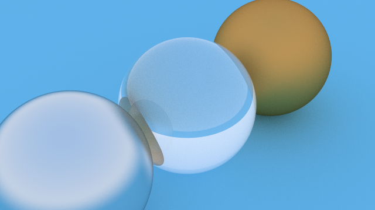

# Raytracer
A textbook C++ Raytracer 
I will remove the wip when the repo is complete.

How to use: 

    set parameters: sanoles per pixel, image width, bounce limit.
    create world: add objects, materials. (some are there already)
    set up camera: position, look at, up vector, FOV, aspect ratio.
    build: main.cpp
    run: cmake-build/raytracer.exe >image.ppm
    open: image.ppm for final render.
    

This repo is based off of Peter Shirley's amazing book (RT in one Weekend).

latest render: 

  

